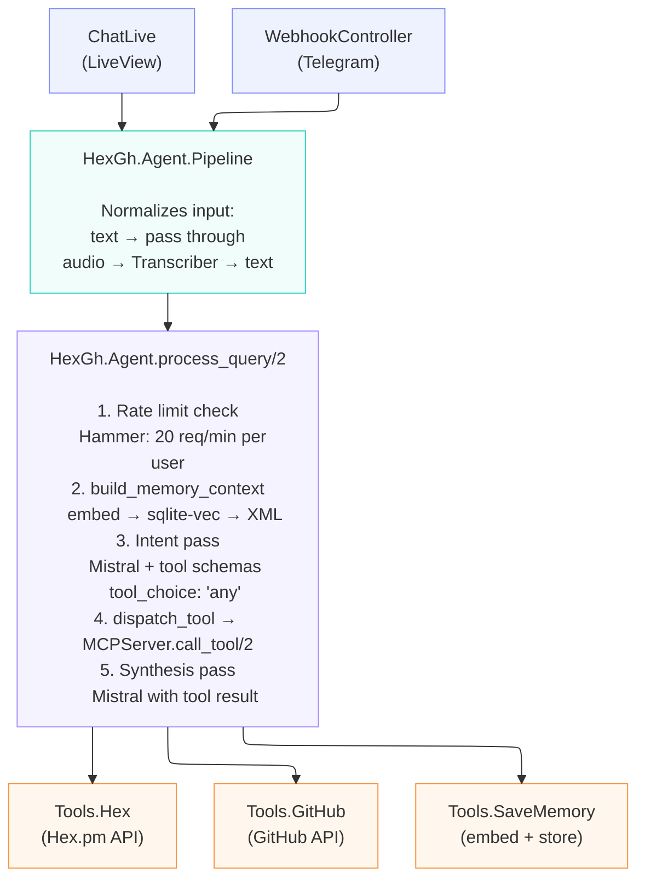
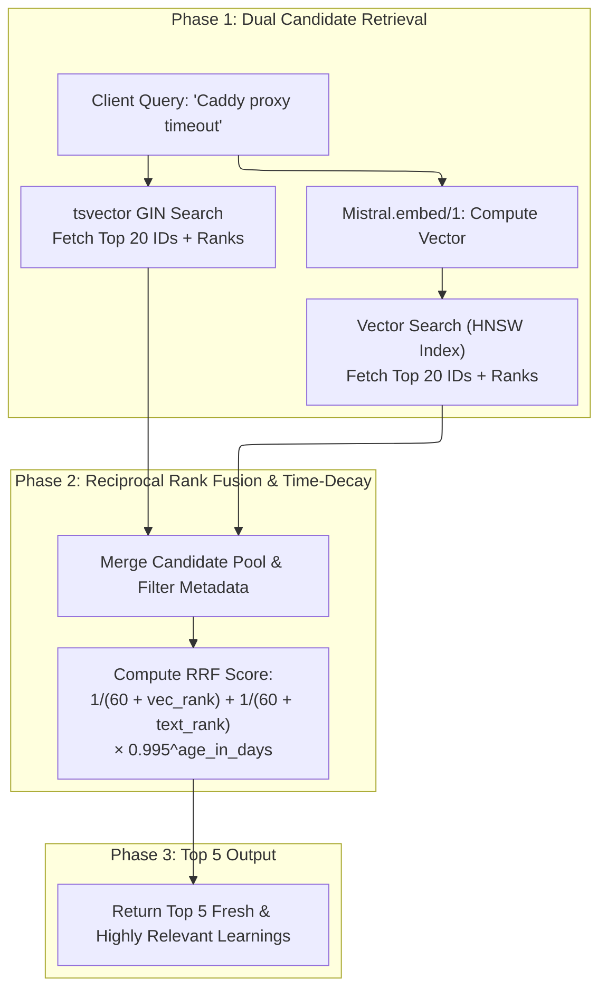
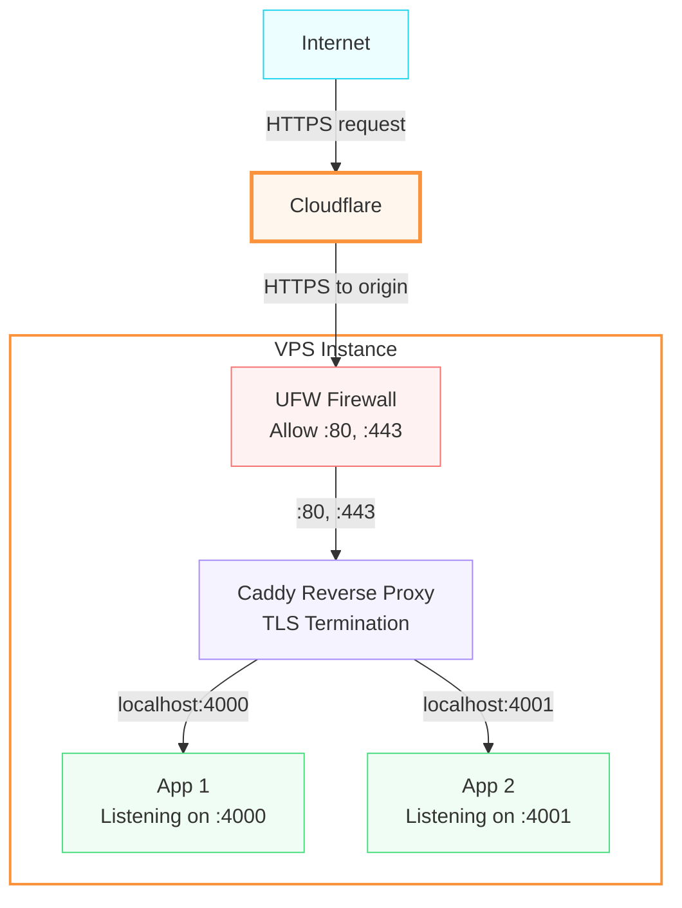

# HexGh

1. AI research assistant for Elixir packages and GitHub issues, with long-term vector memory (SQLite) and web or Telegram interface

2. MCP tool for Elixir packages and Github issues search and `remember` and `recall` functionalities to save knowledge and retrieve similar facts from the Postgres Vecotr database.

## What it does

Three entry points:

- **LiveView chat UI** at `https://hexgh.nlex.uk` <—> `http://localhost:4000` synchronous pipeline, blocks until response
- **Telegram webhook** at @HexGithub <-> `POST /webhook/telegram` — async via Task.Supervisor to avoid Telegram retry on slow responses
- **MCP server** at `https://hexgh.nlex.uk/mcp` — exposes public tools (Hex.pm search, GitHub issue search, `remember` and `recall`) to external MCP clients like Claude Code. Heavily based on [this repo](https://github.com/jfim/passeur).

Natural language queries go through a 5-step pipeline:

```txt
User input (text or voice)
  → Audio transcription (if voice, via Mistral Voxtral)
  → RAG memory lookup (embed query → sqlite-vec top-3 similarity search → inject into prompt)
  → Intent pass (Mistral chat with forced tool calling via tool_choice: "any")
  → Tool dispatch (search_hex_packages | search_github_issues | save_memory)
  → Synthesis pass (Mistral summarizes tool results into Markdown)
  → Response
```

## Search asistance architecture



### Key design decisions

- **Forced tool calling** — `tool_choice: "any"` ensures Mistral always picks a tool. The `/chat/completions` endpoint is the only Mistral endpoint supporting function/tool calling.
- **Synchronous LiveView** — the pipeline runs synchronously in `handle_info`. Speed is not a priority; simplicity is.
- **Async Telegram** — `Task.Supervisor` dispatches pipeline work so the webhook returns 200 immediately, avoiding Telegram's ~10s retry timeout.
- **GenServer for Memory** — SQLite connection stays open in GenServer state. The GenServer serializes access, matching SQLite's single-writer model.
- **sqlite-vec storage** — uses a `vec0` virtual table for KNN indexing. Vectors are passed as little-endian float32 binary blobs. KNN queries use `WHERE embedding MATCH ?blob AND k = ?limit` (not SQL `LIMIT`).
- **RAG distance threshold** — results with cosine distance above 0.65 are filtered out before prompt injection, preventing irrelevant memories from polluting the context.
- **Dual MCP servers** — `MCPServer` (internal, all tools) is used by the Agent for Mistral tool calling. `MCPServer.Public` (public, search tools only) is exposed via HTTP+SSE for external clients like Claude Code.

### Save_memory / Enhance search with RAG memory

You can save facts:  send a message "Remember that Bandit is the default Elixir HTTP server" or "Save that Bandit is the default Elixir webserver".
This will be saved as a vector, and further injected into the prompt if the embedding computation of a user's message is close. It will tend to promote to return Bandit rather than Cowboy.

There is threshold (cosine < 0.65 and top 3 hints). However, there is a limitation with RAG explained below.

> [!WARNING]
> Firstly, one should preferably only save facts and not some preferences because injecting a preference can mislead the LLM if old preferences bleed into unrelated queries. But facts can also become outdated. For example, a default implementation can be changed which makes a statement like "the default package for na HTTP server is Bandit" become false. Another example: saving "I'm interested in LiveView issues in phoenixframework" would then surface on a query like "find issues about database performance in ecto" — and the LLM might still search phoenixframework instead of elixir-ecto.

## MCP

The MCP provides four tools:

```txt
compile-time tools: ["recall", "remember", "search_github_issues", "search_hex_packages"]
```

### Example

```sh
> Search hex.p Elixir packages related to Oauth

> hexgh/search_hex_packages(Call hexgh search_hex_packages MCP tool) (ctrl+o to expand)
```

**Result**:

```txt
  I called your MCP tool (search_hex_packages on hexgh) for query "oauth". Here are top Elixir OAuth packages sorted by popularity:

   Package                        │ Description                                                                          │ Latest Version                │ Total Downloads
  ────────────────────────────────┼──────────────────────────────────────────────────────────────────────────────────────┼───────────────────────────────┼───────────────────────────────
   oauth2[1]                      │ An Elixir OAuth 2.0 Client Library                                                   │ 2.1.1                         │ 14,228,321
   oauther[2]                     │ A library to authenticate using the OAuth 1.0 protocol                               │ 1.3.0                         │ 26,362,062
   boruta[3]                      │ Core of an OAuth/OpenID Connect provider enabling authorization in your applications │ 3.0.0-beta.4                  │ 474,691
   ex_oauth2_provider[4]          │ No brainer OAuth 2.0 provider                                                        │ 0.5.7                         │ 466,380
   elixir_auth_google[5]          │ Minimalist Google OAuth Authentication for Elixir Apps                               │ 1.6.11                        │ 392,112
   phoenix_oauth2_provider[6]     │ Setup an OAuth 2.0 server in your Phoenix app                                        │ 0.5.1                         │ 266,518
   kafka_ex[7]                    │ Elixir client for Apache Kafka with OAuth / SASL support                             │ 1.1.1                         │ 32,372,036
   brod_oauth[8]                  │ Brod plugin for OAuth bearer support                                                 │ 0.1.1                         │ 175,934

  [1]: oauth2 <https://hex.pm/packages/oauth2>
  [2]: oauther <https://hex.pm/packages/oauther>
  [3]: boruta <https://hex.pm/packages/boruta>
  [4]: ex_oauth2_provider <https://hex.pm/packages/ex_oauth2_provider>
  [5]: elixir_auth_google <https://hex.pm/packages/elixir_auth_google>
  [6]: phoenix_oauth2_provider <https://hex.pm/packages/phoenix_oauth2_provider>
  [7]: kafka_ex <https://hex.pm/packages/kafka_ex>
  [8]: brod_oauth <https://hex.pm/packages/brod_oauth>
```

**Key Capabilities & Benefits**:

  1. Real-time Hex.pm Package Discovery (search_hex_packages)
      • No Hallucinations: Prevents the AI from guessing non-existent package names or deprecated version numbers.
      • Dependency Inspection: Instantly checks active maintenance status, recent downloads, and latest releases when suggesting dependencies for your Phoenix app.
  2. GitHub Issue & Bug Resolution (search_github_issues)
      • Automated Debugging: When an error or edge case arises with an Elixir library, the agent can search GitHub issues directly to check for known bugs, workarounds, or breaking
      changes without requiring you to switch to a browser.
  3. Persistent Project Memory (remember / recall)
      • Cross-Session Context: Allows agents to save design decisions, deployment configurations (e.g., Caddy proxy rules, environment setups), and troubleshooting steps, retrieving
      them in future conversations.
  4. Universal Interoperability
      • Because it's deployed as a standard MCP HTTP service at <https://hexgh.nlex.uk/mcp>, any MCP-compliant tool (Claude Code, Cursor, Antigravity CLI, VS Code) can use it seamlessly.

The request flow is:

```txt
Client → Authorization: Bearer <MCP_API_KEY> → BearerAuth plug (secure_compare) → MCPRateLimit (60 req/min/IP) → Anubis StreamableHTTP
```

### Remember architecture

The `remember` tool uses a custom deduplication and consolidation pipeline backed by PostgreSQL and pgvector. When a new learning arrives, the system embeds it, searches for similar existing entries, and delegates the create/update/discard decision to a medium-tier LLM (configurable via `MISTRAL_MODEL_LARGE`).

#### Decision taxonomy

| Action | When | What happens |
|-----------|-------------------------------------------------------|---------------------------------------|
| **create** | No similar neighbors (similarity < 0.7) | New entry |
| **discard** | Too similar (> 0.9), no additional value | Do nothing |
| **append** | Similar neighbor, new info adds value | Concatenate to existing content |
| **merge** | Overlapping but complementary info | Synthesize old + new into one entry |
| **replace** | Old info is factually wrong/superseded | Replace content of existing entry |
| **deprecate** | Neighbor is outdated by new info | Mark old as `outdated=true` |

#### Flowchart

```mermaid
---
config:
  layout: elk
---
flowchart TD
    Start([LLM Client Invokes 'remember' Tool]) --> Spawn[Spawn Background Worker<br/>Task.Supervisor.start_child]
    Spawn --> ReplyClient[Immediate Response to Client:<br/>accepted: true, status: 'processing']
    ReplyClient --> EmbedRaw

    subgraph col1["Search & Analysis"]
        EmbedRaw[Mistral.embed/1:<br/>Embed Raw Text]
        SearchDb[KnowledgeBase.search/2:<br/>KNN search in Postgres]
        FilterClose{Similarity<br/>>= 0.7?}

        EmbedRaw --> SearchDb
        SearchDb --> FilterClose
    end

    FilterClose -- "No Close Neighbors<br/>Similarity < 0.7" --> ActionCreate
    FilterClose -- "Close Neighbors<br/>Found" --> AskMistral

    subgraph col2["Decision Logic (medium model)"]
        AskMistral[Mistral.chat/3<br/>mistral-medium-latest:<br/>Evaluate with decision guide]
        DecodeJSON{Decode Decision<br/>JSON}

        AskMistral --> DecodeJSON
    end

    DecodeJSON -- "discard" --> ActionDiscard([Discard:<br/>Do Nothing])
    DecodeJSON -- "append / merge /<br/>replace" --> ActionUpdate[Update<br/>existing entry]
    DecodeJSON -- "deprecate" --> ActionDeprecate[Mark old as<br/>outdated=true]
    DecodeJSON -- "create" --> ActionCreate[Create<br/>New Entry]
    DecodeJSON -- "Decode Fail /<br/>Fallback" --> FallbackCreate[Create<br/>Fallback]

    subgraph col3["Structuring & Embedding (small model)"]
        StructureText[Mistral.chat/3<br/>mistral-small-latest:<br/>Extract metadata:<br/>domain, stack, versions]
        EmbedFinal[Mistral.embed/1:<br/>Embed structured text]

        StructureText --> EmbedFinal
    end

    ActionCreate --> StructureText
    FallbackCreate --> StructureText
    ActionUpdate --> StructureText

    EmbedFinal --> SaveOrUpdate{Execute<br/>Decision}

    subgraph col4["Persistence"]
        InsertPostgres[KnowledgeBase.save/1:<br/>Insert to Postgres]
        UpdatePostgres[KnowledgeBase.update/2:<br/>Update Postgres]
        DeprecatePostgres[KnowledgeBase.deprecate/2:<br/>Soft-delete]
        VerifyUpdate{Update<br/>Success?}

        UpdatePostgres --> VerifyUpdate
        VerifyUpdate -- "No<br/>ID missing" --> InsertPostgres
        InsertPostgres --> Done([Done])
        VerifyUpdate -- "Yes" --> Done
        DeprecatePostgres --> Done
    end

    SaveOrUpdate -- "Create" --> InsertPostgres
    SaveOrUpdate -- "Update" --> UpdatePostgres
    ActionDeprecate --> DeprecatePostgres

    classDef startEnd fill:#f0fdf4,stroke:#4ade80
    classDef search fill:#ecfeff,stroke:#22d3ee
    classDef decision fill:#fdf4ff,stroke:#e879f9
    classDef process fill:#fff7ed,stroke:#fb923c
    classDef persist fill:#f0f9ff,stroke:#38bdf8
    classDef subgraphStyle fill:#fefce8,stroke:#facc15
    classDef discardStyle fill:#fef2f2,stroke:#f87171

    class Start,Done startEnd
    class ActionDiscard discardStyle
    class col1 subgraphStyle
    class col2 subgraphStyle
    class col3 subgraphStyle
    class col4 subgraphStyle
```



### Recall architecture

The `recall` tool uses Pattern 2 (Two-Phase Candidate Fetching + Reciprocal Rank Fusion + Recency Decay) in PostgreSQL to perform hybrid search across vectors and keywords:



## Configuration

All settings are in `config/runtime.exs`, read from environment variables:

| Variable | Default | Description |
| ---------- | --------- | ------------- |
| `MISTRAL_API_KEY` | required | Mistral API key |
| `MISTRAL_API_URL` | `https://api.mistral.ai/v1` | Mistral API base URL |
| `MISTRAL_MODEL_SMALL` | `mistral-small-latest` | Cheap model for structuring, metadata extraction |
| `MISTRAL_MODEL_LARGE` | `mistral-medium-latest` | Capable model for judgment calls (dedup decisions) |
| `MISTRAL_MODEL_EMBED` | `mistral-embed` | Embedding model |
| `MISTRAL_EMBED_DIMENSIONS` | `1024` | Embedding vector dimensions |
| `MISTRAL_TRANSCRIPTION_MODEL` | `voxtral-mini-latest` | Audio transcription model |
| `GITHUB_API_URL` | `https://api.github.com` | GitHub API base URL |
| `GITHUB_TOKEN` | optional | GitHub personal access token |
| `HEX_API_URL` | `https://hex.pm/api` | Hex.pm API base URL |
| `MEMORY_DB_PATH` | `priv/memory.db` | SQLite database path |
| `SQLITE_VEC_PATH` | auto-detected | Path to sqlite-vec extension (.so/.dylib) |
| `MEMORY_DISTANCE_THRESHOLD` | `0.65` | Cosine distance cutoff for RAG results |
| `MCP_API_KEY` | optional | Bearer token for public MCP endpoint (open access if unset) |
| `TELEGRAM_BOT_TOKEN` | generate @botFather | Telegram bot token (enables webhook) |
| `TELEGRAM_SECRET_TOKEN` | required if bot token set | Webhook validation secret |
| `TELEGRAM_WEBHOOK_URL` | your-domain.com | Public base URL for webhook (e.g. `https://your-tunnel.domain`) |

## Setup

### Local dev

```bash
# Dependencies
mix deps.get

# sqlite-vec (required for vector memory)
pip3 install sqlite-vec
# Or set SQLITE_VEC_PATH to the .so/.dylib location

# Run
source .env && mix phx.server

# check the container build before deploy
source .env && docker compose up --build -d
docker compose logs hexgh
```

### Deploy VPS

System: `ubuntu`

Copy the local _.env_ to the VPS (no Docker Secrets used here)

```bash
scp .env ubuntu@vps-ip:/go-to-git-clone-folder/
```

### Deployment: my current settings

This app uses `Cloudflare` in front of a VPS with "orange" (DDos, hide real IP) and deployed for each subdomain.

`Caddy` is used, is the TLS termination, and is used as reverse-proxy since I have several apps & routes (MinIO dashboard, MinIO/S3 server, Grafana, two apps).



_Caddyfile_ rule:

```caddyfile
hexgh.nlex.uk {
    reverse_proxy localhost:4001
}
```

Copy the Caddyfile into the VPS and start Caddy:

```bash
localhost> scp Caddyfile.deploy ubuntu@xx.xx.xx.xx:/tmp/Caddyfile
localhost> ssh ubuntu@xx.xx.xx.xx
ubuntu@vps-yyyyyy> cp /tmp/Caddyfile /etc/caddy/Caddyfile && sudo systemctl reload caddy
```

Deploy:

```bash
ubuntu@vps-yyyyyy> docker compose up --build
```

Check:

```bash
ubuntu@vps-yyyyyy> docker compose logs hexgh
ubuntu@vps-yyyyyy> docker stats
# 170MB
```

## MCP Server (for Claude Code / external clients)

The app exposes public tools via the [Model Context Protocol](https://modelcontextprotocol.io/) at `https://hexgh.nlex.uk/mcp`. Internal tools (`save_memory`, `out_of_scope`) are not exposed.

### Authentication

The endpoint is protected by a Bearer token validated with `Plug.Crypto.secure_compare/2` (constant-time comparison). Set `MCP_API_KEY` in your `.env` to enable it. When unset, the endpoint is open.

### Connect from Claude Code

Add to your Claude Code MCP settings (`~/.claude.json` or project `.mcp.json`):

```json
{
  "mcpServers": {
    "hexgh": {
      "url": "https://hexgh.nlex.uk/mcp/sse",
      "headers": {
        "Authorization": "Bearer your-mcp-api-key"
      }
    }
  }
}
```

For local development (no auth if `MCP_API_KEY` is unset):

```json
{
  "mcpServers": {
    "hexgh": {
      "url": "http://localhost:4000/mcp/sse"
    }
  }
}
```

Or use the stdio transport (no web server needed, no auth):

```json
{
  "mcpServers": {
    "hexgh": {
      "command": "mix",
      "args": ["mcp.server"],
      "cwd": "/path/to/hex_gh"
    }
  }
}
```

### Available tools

| Tool | Description |
|------|-------------|
| `search_hex_packages` | Search Elixir packages on Hex.pm by keyword |
| `search_github_issues` | Search GitHub issues/PRs across an organization (public repos only) |

## Testing

Integration tests use real API calls (not mocked):

```bash
source .env && MISTRAL_API_KEY="$MISTRAL_API_KEY" mix test --trace
```

Tests are tagged `@moduletag :integration` and cover:

- Mistral embed, chat, and tool calling
- Memory save/retrieve roundtrip via sqlite-vec
- Tool dispatch (Hex.pm, GitHub, save_memory)
- RAG context injection (`build_memory_context` returns relevant facts in `<user_saved_knowledge>`)
- Full agent pipeline end-to-end

A separate test DB (`priv/test_memory.db`) is used and wiped on each run.

## Project structure

`tree`:

```txt
lib/
├── hex_gh/
│   ├── agent.ex              # 5-step pipeline orchestrator
│   ├── agent/pipeline.ex     # Entry point: text passthrough or audio transcription
│   ├── ai/
│   │   ├── mistral.ex        # Mistral API client (chat + embeddings)
│   │   └── transcriber.ex    # Audio transcription (Mistral Voxtral / local Whisper)
│   ├── mcp_server.ex         # Internal tool schemas + dispatch (all tools)
│   ├── mcp_server/
│   │   └── public.ex         # Public MCP server (ExMCP DSL, HTTP+SSE)
│   ├── memory.ex             # GenServer wrapping SQLite + sqlite-vec
│   ├── telegram.ex           # Telegram API helpers
│   ├── telegram/handler.ex   # Webhook update processor
│   ├── tools/
│   │   ├── github.ex         # GitHub issue search
│   │   ├── hex.ex            # Hex.pm package search
│   │   └── save_memory.ex    # Memory storage with package enrichment
│   └── application.ex        # Supervision tree
└── hex_gh_web/
    ├── live/chat_live.ex      # LiveView chat interface
    ├── controllers/
    │   └── webhook_controller.ex  # Telegram webhook endpoint
    └── router.ex
```
