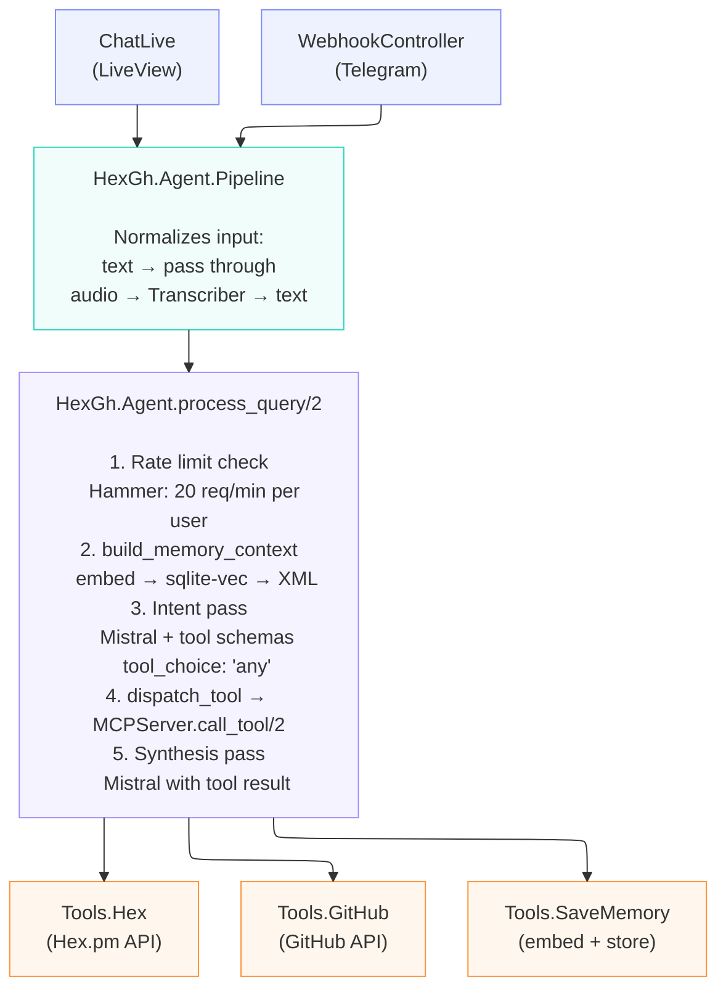

# HexGh

AI research assistant for Elixir packages and GitHub issues, with long-term vector memory.

## What it does

Natural language queries go through a 5-step pipeline:

```
User input (text or voice)
  → Audio transcription (if voice, via Mistral Voxtral)
  → RAG memory lookup (embed query → sqlite-vec top-3 similarity search → inject into prompt)
  → Intent pass (Mistral chat with forced tool calling via tool_choice: "any")
  → Tool dispatch (search_hex_packages | search_github_issues | save_memory)
  → Synthesis pass (Mistral summarizes tool results into Markdown)
  → Response
```

Two entry points:

- **LiveView chat UI** at `http://localhost:4000` — synchronous pipeline, blocks until response
- **Telegram webhook** at `POST /webhook/telegram` — async via Task.Supervisor to avoid Telegram retry on slow responses

## Architecture



### Key design decisions

- **Forced tool calling** — `tool_choice: "any"` ensures Mistral always picks a tool. The `/chat/completions` endpoint is the only Mistral endpoint supporting function/tool calling.
- **Synchronous LiveView** — the pipeline runs synchronously in `handle_info`. Speed is not a priority; simplicity is.
- **Async Telegram** — `Task.Supervisor` dispatches pipeline work so the webhook returns 200 immediately, avoiding Telegram's ~10s retry timeout.
- **GenServer for Memory** — SQLite connection stays open in GenServer state. The GenServer serializes access, matching SQLite's single-writer model.
- **sqlite-vec storage** — uses a `vec0` virtual table for KNN indexing. Vectors are passed as little-endian float32 binary blobs. KNN queries use `WHERE embedding MATCH ?blob AND k = ?limit` (not SQL `LIMIT`).
- **RAG distance threshold** — results with cosine distance above 0.7 are filtered out before prompt injection, preventing irrelevant memories from polluting the context.
- **No ExMCP GenHandler** — `MCPServer` is a plain module with `tool_schemas/0` and `call_tool/2`. The Agent orchestrates tool calls directly via the Mistral API.

## Configuration

All settings are in `config/runtime.exs`, read from environment variables:

| Variable | Default | Description |
| ---------- | --------- | ------------- |
| `MISTRAL_API_KEY` | required | Mistral API key |
| `MISTRAL_API_URL` | `https://api.mistral.ai/v1` | Mistral API base URL |
| `MISTRAL_CHAT_MODEL` | `mistral-small-latest` | Chat/intent/synthesis model |
| `MISTRAL_EMBED_MODEL` | `mistral-embed` | Embedding model |
| `MISTRAL_EMBED_DIMENSIONS` | `1024` | Embedding vector dimensions |
| `MISTRAL_TRANSCRIPTION_MODEL` | `mistral-large-latest` | Audio transcription model |
| `GITHUB_API_URL` | `https://api.github.com` | GitHub API base URL |
| `GITHUB_TOKEN` | optional | GitHub personal access token |
| `HEX_API_URL` | `https://hex.pm/api` | Hex.pm API base URL |
| `MEMORY_DB_PATH` | `priv/memory.db` | SQLite database path |
| `SQLITE_VEC_PATH` | auto-detected | Path to sqlite-vec extension (.so/.dylib) |
| `MEMORY_DISTANCE_THRESHOLD` | `0.7` | Cosine distance cutoff for RAG results |
| `TELEGRAM_BOT_TOKEN` | optional | Telegram bot token (enables webhook) |
| `TELEGRAM_SECRET_TOKEN` | required if bot token set | Webhook validation secret |
| `TELEGRAM_WEBHOOK_URL` | optional | Public base URL for webhook (e.g. `https://your-tunnel.domain`) |

## Setup

```bash
# Dependencies
mix deps.get

# sqlite-vec (required for vector memory)
pip3 install sqlite-vec
# Or set SQLITE_VEC_PATH to the .so/.dylib location

# Environment
cp .env.example .env
# Edit .env with your MISTRAL_API_KEY

# Run
source .env && mix phx.server
```

## Testing

Integration tests use real API calls (not mocked):

```bash
source .env && MISTRAL_API_KEY="$MISTRAL_API_KEY" mix test --trace
```

Tests are tagged `@moduletag :integration` and cover:

- Mistral embed, chat, and tool calling
- Memory save/retrieve roundtrip via sqlite-vec
- Tool dispatch (Hex.pm, GitHub, save_memory)
- RAG context injection (`build_memory_context` returns relevant facts in `<user_saved_knowledge>`)
- Full agent pipeline end-to-end

A separate test DB (`priv/test_memory.db`) is used and wiped on each run.

## Project structure

```
lib/
├── hex_gh/
│   ├── agent.ex              # 5-step pipeline orchestrator
│   ├── agent/pipeline.ex     # Entry point: text passthrough or audio transcription
│   ├── ai/
│   │   ├── mistral.ex        # Mistral API client (chat + embeddings)
│   │   └── transcriber.ex    # Audio transcription (Mistral Voxtral / local Whisper)
│   ├── mcp_server.ex         # Tool schemas + dispatch router
│   ├── memory.ex             # GenServer wrapping SQLite + sqlite-vec
│   ├── telegram.ex           # Telegram API helpers
│   ├── telegram/handler.ex   # Webhook update processor
│   ├── tools/
│   │   ├── github.ex         # GitHub issue search
│   │   ├── hex.ex            # Hex.pm package search
│   │   └── save_memory.ex    # Memory storage with package enrichment
│   └── application.ex        # Supervision tree
└── hex_gh_web/
    ├── live/chat_live.ex      # LiveView chat interface
    ├── controllers/
    │   └── webhook_controller.ex  # Telegram webhook endpoint
    └── router.ex
```
